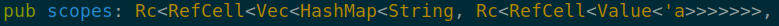

# h4
A WIP modern [m4](https://en.wikipedia.org/wiki/M4_(computer_language))
alternative written in Rust.
Its main feature is the embedded [QuickJs](https://bellard.org/quickjs/) engine,
which allows for conventional programming inside the macros.
It does not try to be compatible for m4,
which allows for the addition of scopes and other breaking features.

## Usage
TODO

## How does it work?

